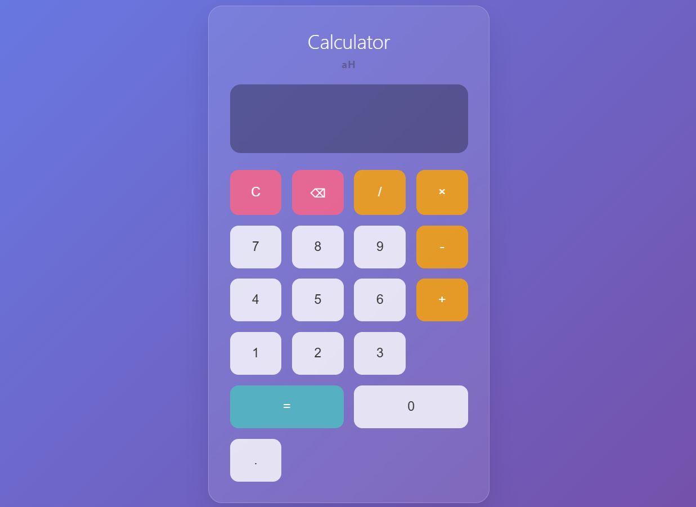

# Basic Calculator

A clean, minimal web-based calculator for performing basic mathematical operations.



## Features

- **Basic Operations**: Addition, subtraction, multiplication, and division
- **Decimal Support**: Handle decimal numbers with precision
- **Keyboard Support**: Use both mouse clicks and keyboard input
- **Error Handling**: Proper validation for division by zero and invalid operations
- **Responsive Design**: Works seamlessly across different screen sizes
- **Minimal UI**: Clean, professional interface with minimal color scheme

## Live Demo

[View Live Calculator](https://ayushhardeniya.github.io/basic-calculator)

## Technologies Used

- HTML5
- CSS3
- Vanilla JavaScript

## Getting Started

### Installation

1. Clone the repository:
```bash
git clone https://github.com/yourusername/basic-calculator.git
```

2. Navigate to the project directory:
```bash
cd basic-calculator
```

3. Open `index.html` in your web browser or use a local server.

### Usage

- Click number buttons to input values
- Use operation buttons (+, -, ×, /) for calculations
- Press "=" to get the result
- Use "C" to clear the display
- Use "⌫" to delete the last entered character

### Keyboard Shortcuts

- **Numbers (0-9)**: Input numbers
- **Operators (+, -, *, /)**: Mathematical operations
- **Enter or =**: Calculate result
- **Escape or C**: Clear display
- **Backspace**: Delete last character
- **Decimal point (.)**: Add decimal point

## Project Structure

```
basic-calculator/
│
├── index.html         # Main HTML file (including* Internal CSS and Script
├── README.md          # Project documentation
└── screenshot.png     # Calculator screenshot
└── LICENSE            # MIT License for open source contribution fro beginners
```

## Features Implementation

### Core Functionality
- Real-time calculation display
- Proper operator precedence handling
- Memory management for complex calculations
- Input validation and sanitization

### User Experience
- Smooth hover animations
- Visual feedback for button interactions
- Consistent styling across all elements
- Accessible design principles

## Browser Compatibility

- Chrome (latest)
- Firefox (latest)
- Safari (latest)
- Edge (latest)

## Contributing

1. Fork the project
2. Create your feature branch (`git checkout -b feature/AmazingFeature`)
3. Commit your changes (`git commit -m 'Add some AmazingFeature'`)
4. Push to the branch (`git push origin feature/AmazingFeature`)
5. Open a Pull Request

## Future Enhancements

- Scientific calculator functions
- Memory operations (M+, M-, MR, MC)
- History of calculations
- Theme customization options
- Unit conversion features

## License

This project is open source and available under the [MIT License](LICENSE).

## Contact

Ayush Hardeniya (a.k.a Ayush Sharma)
[Linkedin](https://linkedin.com/in/ayushhardeniya)

Project Link: [https://github.com/yourusername/basic-calculator](https://github.com/yourusername/basic-calculator)
